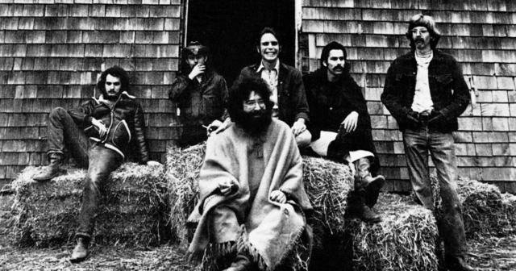

```{r setup, include=FALSE} 
knitr::opts_chunk$set(warning = FALSE, message = FALSE) 
```

 

## Network Details

I am continuing to use the Grateful Dead song writing data set that I am using in [this series of posts](https://www.kristinabecvar.com/blog.html#category:grateful_network){target="_blank"} to examine co-writing links and centrality.

The data set consists of the links between co-writers of songs played by the Grateful Dead over their 30-year touring career that I compiled. 

There are 26 songwriters that contributed to the songs played over the course of the Grateful Dead history, resulting in 26 nodes in the dataset.

There are a total of 183 (updated and still under review!) unique songs played, and the varies combinations of co-writing combinations are now represented in a binary affiliation matrix. 

I have not weighted this version of the data; I am trying to build it from a binary affiliation matrix first, and hope to later add the number of times a given song was played live as a weight.

```{r echo=FALSE, results=FALSE}

library(ggplot2) 
library(readr) 
library(igraph)
library(ggraph)
library(tidyverse)
library(statnet)
library(dplyr)

set.seed(19)
suppressWarnings(expr)

```

### Affiliation Matrix

Loading the dataset and creating the network to begin this assignment:

```{r code_folding=TRUE}
gd_vertices <- read.csv("gd_nodes.csv", header=T, stringsAsFactors=F)
gd_affiliation <- read.csv("gd_affiliation_matrix.csv", row.names = 1, header = TRUE, check.names = FALSE)
gd_matrix <- as.matrix(gd_affiliation)
```

Inspecting the first 8 columns of the data structure in the affiliation matrix format: 

```{r code_folding=TRUE}
dim(gd_matrix)
gd_matrix[1:10, 1:4]
```

### Bipartite Projection

Now I can create the single mode network and examine the bipartite projection. After converting the matrix to a square adjacency matrix, I can look at the full matrix.

I can also call the adjacency matrix count for co-writing incidences between certain songwriters, such as between writing partners Jerry Garcia and Robert Hunter and between John Barlow and Bob Weir.

```{r code_folding=TRUE}
gd_projection <- gd_matrix%*%t(gd_matrix)
dim(gd_projection)
gd_projection[1:10, 1:4]
gd_projection["Jerry Garcia", "Robert Hunter"]
gd_projection["John Barlow", "Bob Weir"]
```

### Network Creation

Now I will use this adjacency matrix to create both igraph and statnet network objects and take a look at their resulting features. This is a non-directed, unweighted dataset.

```{r code_folding=TRUE}
#Create Igraph and Statnet Objects

gd_network_ig <- graph.adjacency(gd_projection,mode="undirected") #igraph object
gd_network_stat <- network(gd_projection, directed=F, matrix.type="adjacency") #statnet object

#Inspect New Objects
print(gd_network_stat)

igraph::vertex_attr_names(gd_network_ig)
igraph::edge_attr_names(gd_network_ig)

head(V(gd_network_ig)$name)

is_directed(gd_network_ig)
is_weighted(gd_network_ig)
is_bipartite(gd_network_ig)
```

### Dyad & Triad Census

Looking at the dyad/triad census info in igraph and statnet:

```{r code_folding=TRUE}

igraph::dyad.census(gd_network_ig)
igraph::triad.census(gd_network_ig)

sna::dyad.census(gd_network_stat)
sna::triad.census(gd_network_stat)

```

Knowing this network has 26 vertices, I want to see if the triad census is working correctly by comparing the following data, which I can confirm it is here!

```{r code_folding=TRUE}

#possible triads in network
26*25*24/6

sum(igraph::triad.census(gd_network_ig))

```

### Transitivity

Looking next at the global v. average local transitivity of the network in igraph and confirming global transitivity in statnet and igraph (Statnet and igraph network transitivity = 0.5241, igraph local transitivity = 0.7756)

```{r code_folding=TRUE}
#network transitivity: statnet
gtrans(gd_network_stat)

#global clustering cofficient: igraph
transitivity(gd_network_ig, type="global")
#average local clustering coefficient: igraph
transitivity(gd_network_ig, type="average")
```

These transitivity results tells me that the average local network transitivity is significantly higher than the global transitivity, indicating, again from my still naive network knowledge, that the overall network is generally more loose, and that there is a more connected sub-network.

### Geodesic Distance

Looking at the geodesic distance tells me that on average, I can confirm that the path length is just over 2, so on average, each node is two "stops" from each other on the geodesic path.

```{r code_folding=TRUE}
average.path.length(gd_network_ig,directed=F)
```

### Components

Getting a look at the components of the network comfirms that there are 2 components in the network, and 25 of the 26 nodes make up the giant component with 1 isolate.

```{r code_folding=TRUE}

names(igraph::components(gd_network_ig))
igraph::components(gd_network_ig)$no 
igraph::components(gd_network_ig)$csize

```

### Density

The network density measure: First with just the call "graph.density" and then with adding "loops=TRUE". In igraph, I know that its' default output assumes that loops are not included but does not remove them, which wwe had corrected with the addition of "loops=TRUE" per the course tutorials when comparing output to statnet. In this case, the statnet output is far different, so I am not sure what is happening with this aspect of the network.

```{r code_folding=TRUE}

graph.density(gd_network_ig, loops=TRUE)

network.density(gd_network_stat)
```

## Degree Centrality

The network degree measure: This gives me a clear output showing the degree of each particular node (songwriter). It is not surprising, knowing my subject matter, that Jerry Garcia is the highest degree node in this network as the practical and figurative head of the band. The other band members' degree measures are not necessarily what I expected, though. I did not anticipate that his songwriting partner, Robert Hunter, would have a lower degree than band members Phil Lesh and Bob Weir. Further, I did not anticipate that the degree measure of band member 'Pigpen' would be so high given his early death in the first years of the band's touring life.

```{r code_folding=TRUE}

igraph::degree(gd_network_ig)

sna::degree(gd_network_stat)

```

To look further I will create a dataframe in igraph first, then statnet.

### Igraph

```{r code_folding=TRUE}

ig_nodes<-data.frame(name=V(gd_network_ig)$name, degree=igraph::degree(gd_network_ig))
head(ig_nodes)

```

### Statnet

```{r code_folding=TRUE}

stat_nodes<-data.frame(name=gd_network_stat%v%"vertex.names", degree=sna::degree(gd_network_stat))
head(stat_nodes)

```

The igraph and statnet dataframes give very different results.

### Summary Statistics

A quick look at the summary statistics confirms for me the minimum, maximum, median, and mean node degree data using each package.

```{r code_folding=TRUE}

summary(ig_nodes)
summary(stat_nodes)

```

### Statnet v. Igraph Degree Treatment

I'm taking a look at the dataframe of the degree nodes, though since it is not a directed network the in and out degrees are not measured or relevant to our network. But it is still interesting to look at how igraph and statnet handle these datasets differently.

#### Statnet

```{r code_folding=TRUE}

#create a dataframe of the total, in and out-degree of nodes in the stat network
gd_stat_nodes <- data.frame(name=gd_network_stat%v%"vertex.names",
    totdegree=sna::degree(gd_network_stat),
    indegree=sna::degree(gd_network_stat, cmode="indegree"),
    outdegree=sna::degree(gd_network_stat, cmode="outdegree"))

#sort the top total degree of nodes in the stat network
arrange(gd_stat_nodes, desc(totdegree))%>%slice(1:5)


```

#### Igraph

```{r code_folding=TRUE}

#create a dataframe of the total, in and out-degree of nodes in the igraph network
gd_ig_nodes<-data.frame(name=V(gd_network_ig)$name, 
                     degree=igraph::degree(gd_network_ig), mode="tot",
                     degree=igraph::degree(gd_network_ig), mode="in",
                     degree=igraph::degree(gd_network_ig), mode="out")

#sort the top total degree of nodes in the igraph network
arrange(gd_ig_nodes, desc(degree))%>%slice(1:5)


```

### Overall Eigenvector Score

The Eigenvector centrality score for each node can be accessed by calling "vector", and I can examine the top eigenvector scores in the igraph network:

```{r echo=TRUE}

#Eigenvector centrality, top 10 in igraph network

eigen_ig <- eigen_centrality(gd_network_ig)
eigen_gd_ig <- data.frame(eigen_ig)
arrange(eigen_gd_ig[1], desc(vector))%>%slice(1:10)

```

### Bonacich Power

The Bonacich power centrality score for each node can be accessed first just using defaults, including setting the index to "1"; then, I can "rescale" so that all of the scores sum "1". 

To display my results, I have to run the calculations and save the results as a dataframe to recall, since the command "bonpow()" is the same in igraph and statnet, which is causing trouble in running then knitting this file.

I need to understand more nuance to the Bonacich power measure in order to fully understand what these two measures say about my specific network.

```{r code_folding=TRUE}

#Compute Bonpow scores

#bp_ig1 <- bonpow(gd_network_ig) #with a default index of "1"
#bonpow_gd_ig1 <- data.frame(bp_ig1)
#write.csv(bonpow_gd_ig1, file = "bonpow_gd_ig1.csv")

#Rescaled so that they sum to "1"

#bp_ig2 <- bonpow(gd_network_ig, rescale = TRUE) #with a default index of "1"
#bonpow_gd_ig2 <- data.frame(bp_ig2)
#write.csv(bonpow_gd_ig2, file = "bonpow_gd_ig2.csv")

```

```{r code_folding=TRUE}

#Read in dataframe from previous chunk

bon1 <- read.csv("bonpow_gd_ig1.csv")
bon2 <- read.csv("bonpow_gd_ig2.csv")

totalbonpow <- merge(bon1,bon2)

totalbonpow

```

Creating a data frame summarizing all of this information and doing basic visualization on a couple of them:

```{r code_folding=TRUE}

gd_adjacency <- as.matrix(as_adjacency_matrix(gd_network_ig))
gd_adjacency_2 <- gd_adjacency %*% gd_adjacency

#calculate portion of reflected centrality
gd_reflective <- diag(as.matrix(gd_adjacency_2))/rowSums(as.matrix(gd_adjacency_2))
gd_reflective <- ifelse(is.nan(gd_reflective),0,gd_reflective)

#calculate derived centrality
gd_derived <- 1-diag(as.matrix(gd_adjacency_2))/rowSums(as.matrix(gd_adjacency_2))
gd_derived <- ifelse(is.nan(gd_derived),1,gd_derived)
#create data frame of centrality measures
centrality_gd <-data.frame(id=1:vcount(gd_network_ig),
                        name=V(gd_network_ig)$name,
                        degree_all=igraph::degree(gd_network_ig),
                        BC_power=power_centrality(gd_network_ig),
                        degree_norm=igraph::degree(gd_network_ig,normalized=T),
                        EV_cent=centr_eigen(gd_network_ig,directed = F)$vector,
                        reflect_EV=gd_reflective*centr_eigen(gd_network_ig,directed = F)$vector,
                        derive_EV=gd_derived*centr_eigen(gd_network_ig,directed = F)$vector)

row.names(centrality_gd)<-NULL
centrality_gd
```

### Graphing Centrality Scores

```{r code_folding=TRUE}
attach(centrality_gd)
breaks<-round(vcount(gd_network_ig))
hist(degree_all,breaks=breaks,
     main=paste("Distribution of Total Degree Scores in GD Songwriters ",sep=""),
     xlab="Total Degree Score")
hist(EV_cent,breaks=breaks,
     main=paste("Distribution of Eigenvector Centrality Scores in GD Songwriters ",sep=""),
    xlab="Eigenvector Centrality Score")
hist(BC_power,breaks=breaks,
     main=paste("Distribution of Bonacich Power Scores in GD Songwriters",sep=""),
     xlab="Bonacich Power Score")
```

I can independently look at the correlations between all scores now. Using prompts from this week's tutorial, it looks that all of the variables except Bonacich power are strongly correlated, so I think I'll want to begin subsetting my network to get more meaningful interpretations.

```{r code_folding=TRUE}
names(centrality_gd) #Find the columns we want to run the correlation on
cols<-c(3:8) #All except the id and name in this instance
corMat<-cor(centrality_gd[,cols],use="complete.obs") #Specify those in the bracket
corMat #Let's look at it, which variables are most strongly correlated?
```

However, I will also make a pretty visualization of the correlation matrix, just because.

```{r message=FALSE, warning=FALSE}
library(corrplot)
corrplot(corMat)
```

*Citations:*

*Allan, Alex; Grateful Dead Lyric & Song Finder: https://whitegum.com/~acsa/intro.htm*

*ASCAP. 18 March 2022.*

*Dodd, David; The Annotated Grateful Dead Lyrics: http://artsites.ucsc.edu/gdead/agdl/*

*Schofield, Matt; The Grateful Dead Family Discography: http://www.deaddisc.com/*

*Photo by Grateful Dead Productions*

*This information is intended for private research only, and not for any commercial use. Original Grateful Dead songs are ©copyright Ice Nine Music*

