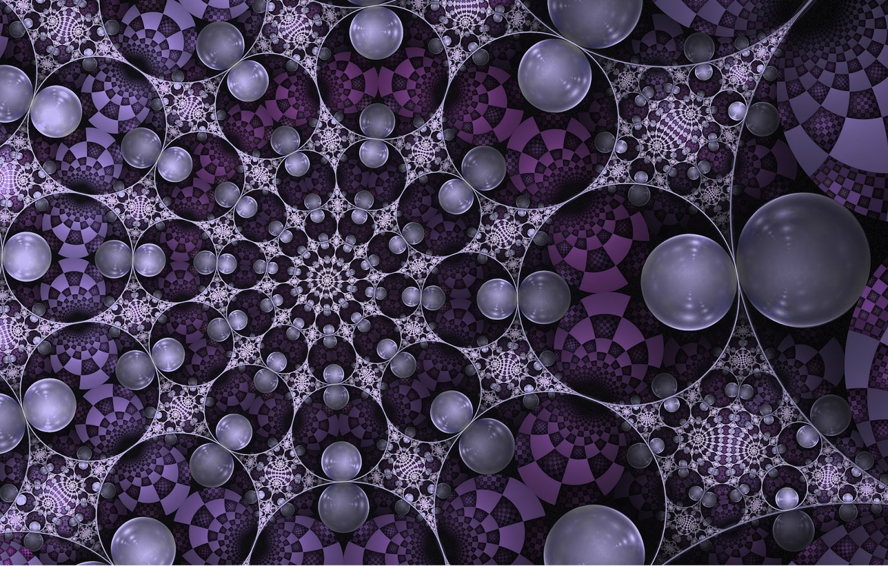

```{r setup, include=FALSE} 
knitr::opts_chunk$set(warning = FALSE, message = FALSE) 
```

 

## Network Details

I am continuing to use the Grateful Dead song writing data set that I used in [previous assignments](https://www.kristinabecvar.com/blog.html#category:grateful_network){target="_blank"} to examine co-writing links and centrality.

The data set consists of the links between co-writers of songs played by the Grateful Dead over their 30-year touring career that I compiled. One aspect of the Grateful Dead song data is that the connections between co-writers is weighted, with the weights representing the number of time each song was played live.

There are 26 songwriters that contributed to the songs played over the course of the Grateful Dead history, resulting in 26 nodes in the dataset.

There are a total of 183 (updated and still under review!) unique songs played, and the varies combinations of co-writing combinations are now represented in a binary affiliation matrix.

```{r echo=FALSE, results=FALSE}

library(ggplot2) 
library(readr) 
library(igraph)
library(ggraph)
library(tidyverse)
library(dplyr)
library(corrr)

set.seed(19)
suppressWarnings(expr)

```

Loading the dataset and creating the network to begin this assignment:

```{r code_folding=TRUE}

gd_vertices <- read.csv("gd_nodes.csv", header=T, stringsAsFactors=F)
gd_affiliation <- read.csv("gd_affiliation_matrix.csv", row.names = 1, header = TRUE, check.names = FALSE)
gd_matrix <- as.matrix(gd_affiliation)
gd_projection <- gd_matrix%*%t(gd_matrix)

#Create Igraph Object

gd_network_ig <- graph.adjacency(gd_projection,mode="undirected") #igraph object

```

This is a non-directed, unweighted igraph object. It has two components; one large component with one isolate.

```{r echo=TRUE}

#Inspect New Object

igraph::vertex_attr_names(gd_network_ig)
igraph::edge_attr_names(gd_network_ig)

head(V(gd_network_ig)$name)

is_directed(gd_network_ig)
is_weighted(gd_network_ig)
is_bipartite(gd_network_ig)

igraph::dyad.census(gd_network_ig)
igraph::triad.census(gd_network_ig)
```
## Centrality Scores

To examine the centrality and power scores of the nodes, I'm creating a data frame with the centrality degree, normalized centrality, Bonacich power, Eigenvector centrality scores and the breakdown of reflected and derived centrality scores.

To calculate the reflected and derived centrality scores, I first run some operations on the adjacency matrix and keep in mind that these two scores make up the entire calculation of the Eigenvector centrality score. 

```{r code_folding=TRUE}

gd_adjacency <- as.matrix(as_adjacency_matrix(gd_network_ig))
gd_adjacency_2 <- gd_adjacency %*% gd_adjacency

#calculate portion of reflected centrality
gd_reflective <- diag(as.matrix(gd_adjacency_2))/rowSums(as.matrix(gd_adjacency_2))
gd_reflective <- ifelse(is.nan(gd_reflective),0,gd_reflective)

#calculate derived centrality
gd_derived <- 1-diag(as.matrix(gd_adjacency_2))/rowSums(as.matrix(gd_adjacency_2))
gd_derived <- ifelse(is.nan(gd_derived),1,gd_derived)

centrality_gd <-data.frame(id=1:vcount(gd_network_ig),
                        name=V(gd_network_ig)$name,
                        degree_all=igraph::degree(gd_network_ig),
                        degree_norm=igraph::degree(gd_network_ig,normalized=T),
                        BC_power=power_centrality(gd_network_ig),
                        EV_cent=centr_eigen(gd_network_ig,directed = F)$vector,
                        reflect_EV=gd_reflective*centr_eigen(gd_network_ig,directed = F)$vector,
                        derive_EV=gd_derived*centr_eigen(gd_network_ig,directed = F)$vector)

row.names(centrality_gd)<-NULL
centrality_gd%>%
  arrange(desc(degree_all))%>%
  slice(1:5)

```

Right away, I see the highest degree are clearly Jerry Garcia and Robert Hunter, which makes sense given that they were a songwriting pair that were prolific in creating the Grateful Dead original songbook. Bob Weir also contributed quite a bit, though the songs he wrote with his writing partner John Barlow numbered many less than those that he wrote as part of the whole band, judging by Barlow's absence in the top counts.

The original lineup of Jerry Garcia, Bob Weir, Phil Lesh, Bill Kreutzmann, and Pigpen as well as Robert Hunter's presence in the formative years of the band's most collaborative era, means that this degree ranking makes sense intuitively.

## Eigenvector Centrality

I am also interested in the Eigenvector centrality scores - Both the top as well as the lowest value scores.

```{r code_folding=TRUE}

centrality_gd%>%
  arrange(desc(EV_cent))%>%
  slice(1:5)

```

Robert Hunter having the top Eigenvector centrality score is not a shock - he has long held the unofficial title of band member and as the person behind the songwriting magic of the Grateful Dead. His primary songwriting partner was Jerry Garcia, but he also wrote songs with the early, full band and later with almost all of the individual members of the band.

It is a little surprising, though, that the Eigenvector scores fall off so quickly after Robert Hunter and Jerry Garcia.

## Closeness

The closeness centrality of a node is defined as the sum of the geodesic distances between that node and all other nodes in a network. This works; however, I get a warning that closeness centrality is not well-defined for disconnected graphs.

```{r, echo=TRUE}

#calculate closeness centrality: igraph
igraph::closeness(gd_network_ig)

```

In addition to node-level centrality scores, I also want to calculate the network level centralization index for closeness centrality measures.  Again, I get a warning that closeness centrality is not well-defined for disconnected graphs.

```{r, echo=TRUE}

#calculate closeness centralization index: igraph
centr_clo(gd_network_ig)$centralization

```

## Betweenness

Betweenness represents the number of geodesics on which a node sits. 

```{r, echo=TRUE}
#calculate betweenness centrality: igraph
igraph::betweenness(gd_network_ig, directed=FALSE)

```
## Top Betweenness

Now I want to add the closeness and betweenness to my centrality data frame and first, sort by and take a look at the nodes with the highest betweenness:

```{r code_folding=TRUE}

centrality_gd <-data.frame(id=1:vcount(gd_network_ig),
                        name=V(gd_network_ig)$name,
                        degree_all=igraph::degree(gd_network_ig),
                        degree_norm=igraph::degree(gd_network_ig,normalized=T),
                        BC_power=power_centrality(gd_network_ig),
                        EV_cent=centr_eigen(gd_network_ig,directed = F)$vector,
                        reflect_EV=gd_reflective*centr_eigen(gd_network_ig,directed = F)$vector,
                        derive_EV=gd_derived*centr_eigen(gd_network_ig,directed = F)$vector,
                        close=closeness(gd_network_ig),
                        between=betweenness(gd_network_ig, directed=FALSE))
                        

row.names(centrality_gd)<-NULL
centrality_gd%>%
  arrange(desc(between))%>%
  slice(1:5)

```

The most immediate observations I have is that the highest degree node (Jerry Garcia) is not the node with the highest scoring betweenness. That goes to Bob Weir, who is still a relatively high degree node, but significantly lower than Jerry Garcia given that his betweenness score is so much higher (~121 compared to Garcia's ~16).

I can make a guess that the two highest degree nodes, Jerry Garcia and Robert Hunter, having relatively low betweenness scores can be linked to the fact that the two wrote mostly together. Although the pair wrote the most songs in the originals catalog, Bob Weir wrote many songs with a variety of other songwrriters; giving him a higher level of betweenness. 

Similarly, Phil Lesh and Pigpen, original band members who wrote relatively fewer songs, contributed to more songs that were written by the entire band, giving them more exposure to connections on the songs that they did write.

## Top Closeness

Now a look at the top closeness scores:

```{r code_folding=TRUE}

centrality_gd%>%
  arrange(desc(close))%>%
  slice(1:5)

```

This evaluation is more difficult as the range is made up of much less clearly defined scores.

## Network Constraint (Burt)

Constraint is a measure of the redundancy of a node’s connections. It is bound between 0 and 1, with 0 being a complete lack, and 1 being complete redundancy.

```{r code_folding=TRUE}
constraint(gd_network_ig)
```

Finally, I'm going to save all of this data into a .csv file for future analysis.

```{r code_folding=TRUE}
centrality_gd <-data.frame(id=1:vcount(gd_network_ig),
                        name=V(gd_network_ig)$name,
                        degree_all=igraph::degree(gd_network_ig),
                        degree_norm=igraph::degree(gd_network_ig,normalized=T),
                        BC_power=power_centrality(gd_network_ig),
                        EV_cent=centr_eigen(gd_network_ig,directed = F)$vector,
                        reflect_EV=gd_reflective*centr_eigen(gd_network_ig,directed = F)$vector,
                        derive_EV=gd_derived*centr_eigen(gd_network_ig,directed = F)$vector,
                        close=closeness(gd_network_ig),
                        between=betweenness(gd_network_ig, directed=FALSE),
                        burt=constraint(gd_network_ig))

write.csv(centrality_gd, file = "centrality_df.csv")

```


*Citations:*

*Allan, Alex; Grateful Dead Lyric & Song Finder: https://whitegum.com/~acsa/intro.htm*

*ASCAP. 18 March 2022.*

*Dodd, David; The Annotated Grateful Dead Lyrics: http://artsites.ucsc.edu/gdead/agdl/*

*Schofield, Matt; The Grateful Dead Family Discography: http://www.deaddisc.com/*

*This information is intended for private research only, and not for any commercial use. Original Grateful Dead songs are ©copyright Ice Nine Music*

