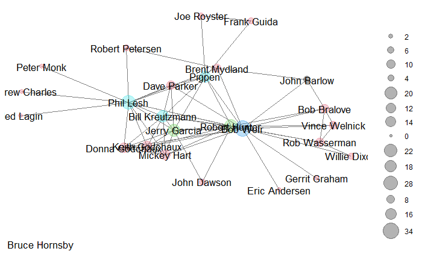

```{r setup, include=FALSE} 
knitr::opts_chunk$set(warning = FALSE, message = FALSE) 
```

 

I am continuing to use the Grateful Dead song writing data set that I used in [previous assignments](https://www.kristinabecvar.com/blog.html#category:grateful_network){target="_blank"} to examine co-writing links and centrality. The data set consists of the links between co-writers of songs played by the Grateful Dead over their 30-year touring career that I compiled. 

There are 26 songwriters that contributed to the songs played over the course of the Grateful Dead history, resulting in 26 nodes in the dataset.

There are a total of 183 (updated and still under review!) unique songs played, and the varies combinations of co-writing combinations are now represented in a binary affiliation matrix.

I plan on eventually introducing the number of times a given song was played live as a method of weighting the network, given the culture of the band and its' community was one of collaboration and the prominence of a song being representative of the level at which it resonated with the community. I need to continue to investigate the best time and way to incorporate those weights.

```{r echo=FALSE, results=FALSE}

library(ggplot2) 
library(readr) 
library(statnet)
library(igraph)
library(ggraph)
library(tidyverse)
library(dplyr)
library(corrr)
library(magrittr)

set.seed(19)
suppressWarnings(expr)

```

Loading the dataset and creating the network to begin this assignment:

```{r code_folding=TRUE}

gd_vertices <- read.csv("gd_nodes.csv", header=T, stringsAsFactors=F)
gd_affiliation <- read.csv("gd_affiliation_matrix.csv", row.names = 1, header = TRUE, check.names = FALSE)
gd_matrix <- as.matrix(gd_affiliation)
gd_projection <- gd_matrix%*%t(gd_matrix)

#Create igraph and statnet Objects

gd_network_ig <- graph.adjacency(gd_projection,mode="undirected") #igraph object
gd_network_stat <- network(gd_projection, directed=F, matrix.type="adjacency") #statnet object

```

## Network Structure

The network is an undirected, unweighted network. It has two components; one large component with one isolate.

The statnet object has a density of 0.2 and a transitivity of 0.5241.

```{r code_folding=TRUE}

#Inspect New igraph and statnet objects

print(gd_network_stat)
igraph::components(gd_network_ig)$no
gden(gd_network_stat)
gtrans(gd_network_stat)

```

## Create a Data Frame

I need to create a data frame of the network node data as in previous tutorials/assignments, but having had trouble using both igraph and statnet in the same .rmd, I used igraph in previous assignments. I'll use statnet in this assignment and inspect the differences as well.

```{r code_folding=TRUE}

get.eigen<-function(net, attr=NULL){
    #set attr="weight" if weighted network
    eigen<-evcent(net)
    mat<-as.matrix.network(net, attr=attr)
    diag(mat)<-0
    mat2<-mat%*%mat
    rc<-diag(mat2)/rowSums(mat2)
    dc<-1-rc
    data.frame(name=net%v%"vertex.names",
        eigen=eigen,
        eigen.rc=eigen*rc,
        eigen.dc=eigen*dc)
}
get.brokerage<-function(net, attr="attr"){
  temp<-data.frame(brokerage(net, cl = net%v%"attr")$z.nli)
  temp$name=net%v%"vertex.names"
  mutate(temp, broker.tot = temp$t,
         broker.coord = temp$w_I,
         broker.itin = temp$w_O,
         broker.rep = temp$b_IO,
         broker.gate = temp$b_OI,
         broker.lia = temp$b_O)%>%
    select(contains("broker"))
}
```

Because I am again having an issue with using igraph and statnet in one knit chunk, I need to save my data frame then recall it to knit.

```{r code_folding=TRUE}

#create dataframe with names
#gd_nodes<-data.frame(name=gd_network_stat%v%"vertex.names",
        #degree=sna::degree(gd_network_stat,gmode="graph"),
        #bonpow=bonpow(gd_network_stat),
        #betweenness=betweenness(gd_network_stat, gmode="graph"),
        #close=sna::closeness(gd_network_stat, gmode="graph", cmode = "undirected"),
        #constraint=constraint(gd_network_ig))

#add eigenvector centrality using custom function
#gd_nodes<-full_join(gd_nodes,get.eigen(gd_network_stat), by="name")

#write csv for retrieval in knitting document
#write.csv(gd_nodes, file = "gd_nodes6.csv")
```
```{r echo=TRUE}
gd_nodes <- read.csv("gd_nodes6.csv")

head(gd_nodes)
```

## Structural Equivalence

Creating the matrix element then taking a look at the summary using the equivalence function "sedist", the default measure of assessing the approximate structural equivalence of actors, or "complete".

### "Complete"

```{r, code_folding=TRUE}
#calculate equivalence from specified distance marix
gd_stat_se<-equiv.clust(gd_network_stat, equiv.fun="sedist", method="hamming",mode="graph")
```

```{r, echo=TRUE}
#summary of object produced by sedist()
summary(gd_stat_se)
#plot equivalence clustering
plot(gd_stat_se,labels=gd_stat_se$glabels)
```

I need to look at the other methods of clustering as well. 

### "Average"

```{r code_folding=TRUE}
#with average cluster.method
gd_avg_se<-equiv.clust(gd_network_stat, equiv.fun="sedist", cluster.method="average", method="hamming",mode="graph")
#plot:
plot(gd_avg_se,labels=gd_stat_se$glabels)
```

### "Single"

```{r code_folding=TRUE}

#with average cluster.method
gd_sing_se<-equiv.clust(gd_network_stat, equiv.fun="sedist", cluster.method="single", method="hamming",mode="graph")

#plot:
plot(gd_sing_se,labels=gd_stat_se$glabels)

```

### "Ward.D"

```{r code_folding=TRUE}

#with average cluster.method
gd_wrd_se<-equiv.clust(gd_network_stat, equiv.fun="sedist", cluster.method="ward.D", method="hamming",mode="graph")

#plot:
plot(gd_wrd_se,labels=gd_stat_se$glabels)

```

It is interesting, because none of these dendograms represent fully what I *feel* accurately represents this network, but it makes me want to look more deeply and understand the network.

## Partition Using Clustering

I understand that the number of partitions (or roles) will depend on the height at which the dendrogram is cut. Using the tutorial example, I set the height at 15 and the result is 5 clusters. Using the alternate view from the tutorial, I also set the height at 10, and identify 8 distinct clusters or roles.

### Height= 15

```{r code_folding=TRUE}

#plot equivalence clustering
plot(gd_stat_se,labels=gd_stat_se$glabels)
#partition the clusters
rect.hclust(gd_stat_se$cluster,h=15)
```

### Height= 10

```{r code_folding=TRUE}

#plot equivalence clustering
plot(gd_stat_se,labels=gd_stat_se$glabels)
#partition the clusters
rect.hclust(gd_stat_se$cluster,h=10)
```

### Height= 3

For my own experimenting, looking at it with an even lower height ("3"), it spreads the clusters out to 16.

```{r code_folding=TRUE}
#plot equivalence clustering
plot(gd_stat_se,labels=gd_stat_se$glabels)
#partition the clusters
rect.hclust(gd_stat_se$cluster,h=3)
```

## Blockmodel Partitions

Inspecting the goodness of fit of the partitions that result from the clustering steps above using blockmodeling to try and get a better sense of how well the partitioning worked. Using the blockmodel command in statnet and specifying "k=x" means that "x" will indicate how many partitions to create, and "h=x" means that "x" will indicate the height to cut the dendogram.

### 2-partition blockmodel

```{r code_folding=TRUE}
#blockmodel and select partitions
blk_mod<-blockmodel(gd_network_stat,gd_stat_se,k=2)
#print blockmodel object
blk_mod
```

```{r code_folding=TRUE}
plot.block<-function(x=blk_mod, main=NULL, cex.lab=1){
  plot.sociomatrix(x$blocked.data, labels=list(x$plabels,x$plabels),
                   main=main, drawlines = FALSE, cex.lab=cex.lab)
  for (j in 2:length(x$plabels)) if (x$block.membership[j] !=
                                     x$block.membership[j-1]) 
    abline(v = j - 0.5, h = j - 0.5, lty = 3, xpd=FALSE)
}
plot.block(blk_mod,main="Grateful Dead Songwriting: 2 Partitions", cex.lab=.4)
```

### 5-partition blockmodel

```{r code_folding=TRUE}
#blockmodel and select partitions
blk_mod2<-blockmodel(gd_network_stat,gd_stat_se,k=5)
#print blockmodel object
blk_mod2$block.model
#plot blockmodel partitions
plot.block(blk_mod2,main="Grateful Dead Songwriting, 5 Partitions", cex.lab=.5)
```

## Plotting Network Roles

To do this, I will assign "block.membership" as a vertex attribute to my 5-partition blockmodel, then use the role attribute to change the color of plotted nodes in a network plot. I am using this part of the tutorial as well because graphics are always a fun thing to do in the middle of learning new concepts and coding all day! I will definitely want to investigate another aspect of this data and graphing options more later because the results show me that this network is not exactly graphing in a familiar way.

```{r code_folding=TRUE}

blk_mod3<-blockmodel(gd_network_stat,gd_stat_se,k=5)

```

### Statnet

 

### Igraph

```{r code_folding=TRUE}
library(igraph)

V(gd_network_ig)$role<-blk_mod3$block.membership[match(V(gd_network_ig)$name,blk_mod3$plabels)]

#plot network using "role" to color nodes: igraph
plot(gd_network_ig, layout=layout_with_kk, vertex.color=V(gd_network_ig)$role)
```

## Centrality by Network Role

I am attempting to use the "gd_nodes" table created earlier and adding the role assignments from the "blockmodel" calculations to summarise average node measures of centrality by role.

Yet again, I am finding that the code used for this process using both igraph and statnet worked until I knit the document, but is giving me trouble at that point, so I will revisit this process. 

```{r code_folding=TRUE}
library(igraph)
#attach role to .nodes dataframe
gd_new_nodes <- gd_nodes$role<-V(gd_network_ig)$role
```

## ConcoR

Utilizing the "concoR" package

```{r code_folding=TRUE}
library(concoR)
#select partitions with concor
concoR::concor_hca(list(gd_projection), p=2)
```

Taking this output and plotting it as I tried earlier, I get a better visualization of the blockmodeling:

```{r echo=FALSE}
#select partitions with concor
blks<-concoR::concor_hca(list(gd_projection), p=2)
#blockmodel with concor
blk_mod <- blockmodel(gd_network_stat, blks$block, plabels=blks$vertex) 
#print blockmodel object
blk_mod$block.model
```

```{r code_folding=TRUE}
#plot blockmodel partitions
plot.block(blk_mod,main="Grateful Dead Songwriting, Concor 4 Partitions", cex.lab=.5)
```

## Best model

Finally, I want to look at the "optimized" 5 partition model, which in the end seems to represent the network most intuitively of the models I've explored so far.

```{r echo=FALSE, eval=FALSE}
#select partitions with optimization
blks<-blockmodeling::optRandomParC(gd_projection, k=5, rep=10, approaches="ss", blocks="com")
#blockmodel with optimized partition
blk_mod <- blockmodel(gd_projection, blks$best$best1$clu, plabels=rownames(gd_projection)) 
#print blockmodel object
blk_mod$block.model
```

```{r code_folding=TRUE}
#plot blockmodel partitions
plot.block(blk_mod,main="Grateful Dead Songwriting, Optimized 5 Partitions", cex.lab=.5)
```

I have more evaluations to do but I continue to struggle with using igraph and statnet in the same .rmd file, so I will revisit this process in future posts.


*Citations:*

*Allan, Alex; Grateful Dead Lyric & Song Finder: https://whitegum.com/~acsa/intro.htm*

*ASCAP. 18 March 2022.*

*Dodd, David; The Annotated Grateful Dead Lyrics: http://artsites.ucsc.edu/gdead/agdl/*

*Schofield, Matt; The Grateful Dead Family Discography: http://www.deaddisc.com/*

*Photo by Grateful Dead Productions*

*This information is intended for private research only, and not for any commercial use. Original Grateful Dead songs are ©copyright Ice Nine Music*

