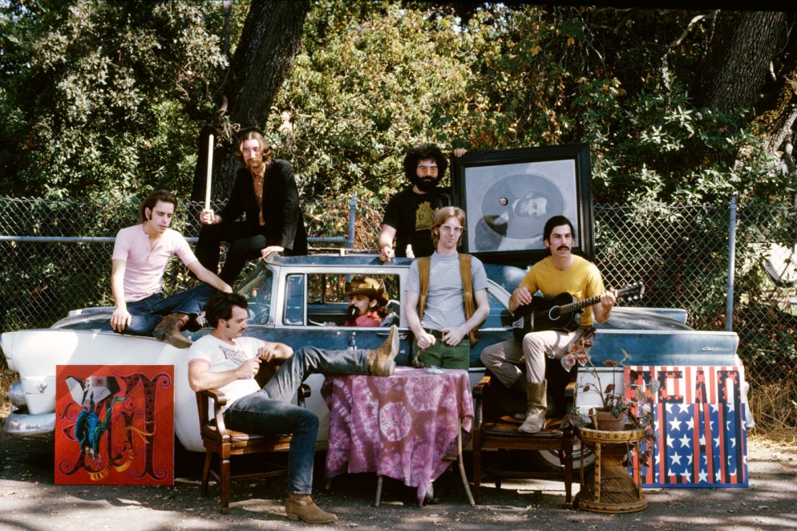

```{r setup, include=FALSE} 
knitr::opts_chunk$set(warning = FALSE, message = FALSE) 
```

 

I am continuing to use the Grateful Dead song writing data set that I used in [previous assignments](https://www.kristinabecvar.com/blog.html#category:grateful_network){target="_blank"} to examine co-writing links and centrality. The data set consists of the links between co-writers of songs played by the Grateful Dead over their 30-year touring career that I compiled. 

There are 26 songwriters that contributed to the songs played over the course of the Grateful Dead history, resulting in 26 nodes in the dataset.

There are a total of 183 (updated and still under review!) unique songs played, and the varies combinations of co-writing combinations are now represented in a binary affiliation matrix.

```{r echo=FALSE, results=FALSE}

library(ggplot2) 
library(readr) 
library(igraph)
library(ggraph)
library(tidyverse)
library(dplyr)
library(corrr)
library(magrittr)

set.seed(19)
suppressWarnings(expr)

```

This week I will calculate community clusters using various algorithms.

## Network Creation

First, I will get my data into an igraph network object and inspect it.

```{r code_folding=TRUE}
#import data
gd_vertices <- read.csv("gd_nodes.csv", header=T, stringsAsFactors=F)
gd_affiliation <- read.csv("gd_affiliation_matrix.csv", row.names = 1, header = TRUE, check.names = FALSE)
gd_matrix <- as.matrix(gd_affiliation)
gd_projection <- gd_matrix%*%t(gd_matrix)
#Create igraph object
gd_network_ig <- graph.adjacency(gd_projection,mode="undirected")
```

### Basic Visualization

```{r echo=FALSE}
set.seed(5)
plot(gd_network_ig, loops=FALSE, displaylabels=T, vertex.cex=3, label.cex=1, edge.col=rgb(150,150,150,100, maxColorValue = 255), label.pos=5, vertex.col="lightblue")
```
## Cleaning

### Simplify Function

The fast and greedy function was giving me an error code of:

*Error in cluster_fast_greedy(gd_network_ig):At fast_community.c:660:* *fast-greedy community finding works only on graphs without multiple* *edges, Invalid value*

Some community sourcing of opinions led me to run the "simplify()" function to correct this.

```{r echo=TRUE}
#create simplified igraph network
simple_gd <- simplify(gd_network_ig)
```

### Giant Component

Creating a function to extract the giant component. The spinglass model will not evaluate unconnected graphs, so I did this step first. The one isolate node, "Bruce Hornsby", is the only songwriter who wrote only a song without collaborating with anyone, and would be the only unevaluated node in the spinglass model.

```{r code_folding=TRUE}
giant.component <- function(graph) {
  cl <- clusters(graph)
  induced.subgraph(graph, which(cl$membership == which.max(cl$csize)))
}
```

```{r code_folding=TRUE}
#extract giant component
gd_giant<-giant.component(gd_network_ig)
```

## Fast and Greedy Community

The method attempts to detect dense sub-graphs by optimizing modularity scores on igraph networks that are un-directed. I'll start with inspecting the names that are part of the new object.

```{r code_folding=TRUE}
#run fast_greedy clustering algorithm
#fg_gd <- cluster_fast_greedy(simple_gd)
```

```{r echo=FALSE}
#saveRDS(fg_gd, "fg_gd.RData")
```

```{r echo=FALSE}
fg_gd <- readRDS("fg_gd.RData")
```
```{r code_folding=TRUE}
#inspect
names(fg_gd)
```

### Groups

Looking at the list of which nodes belong to which clusters:

```{r code_folding=TRUE}

igraph::groups(fg_gd)
```

### Community Membership

First I'm inspecting the community membership as a vector

```{r code_folding=TRUE}
#Inspect community membership vector
fg_gd$membership
```

And I can confirm which of the 5 membership groups each songwriter is part of:

```{r code_folding=TRUE}
#Membership function
membership(fg_gd)
```

### Plot the Network with Community Colors

Igraph colors the nodes by community

```{r code_folding=TRUE}
#plot network with community coloring
plot(fg_gd,gd_network_ig)
```

## Walktrap Community Detection and Plot

The walktrap community detection created two communities; one community is the lone isolate, and the rest of the songwriters are in the other community with the giant component.

```{r code_folding=TRUE}
#Run clustering algorithm: walktrap
wt_gd <- walktrap.community(gd_network_ig)
#Inspect community membership
igraph::groups(wt_gd)
```

### Plot the Network with Community Colors

Igraph colors the nodes by community

```{r code_folding=TRUE}
#plot network with community coloring
plot(wt_gd,gd_network_ig)
```

## Compare Community Partitions - Fast and Greedy and Walktrap

The modularity score for the fast and greedy algorithm is higher than the walktrap algorithm, as predicted by the tutorial. 

It would be worth comparing these scores on a weighted network in the future since it would take that into consideration.

```{r code_folding=TRUE}
#compare community partition modularity scores
modularity(fg_gd)
```

```{r code_folding=TRUE}
#compare community partition modularity scores
modularity(wt_gd)
```

### Collect & Compare Modularity Scores 

Saving the scores for evaluation and later analysis; I will continue to add the other community modularity scores into this vector as I run them.

```{r echo=TRUE}
mods<-c(fastgreedy=modularity(fg_gd), walktrap=modularity(wt_gd))
mods
```

#### Variation Method

```{r code_folding=TRUE}
#compare community partitions using variation of information
compare(fg_gd,wt_gd,method="vi")
```

#### Normalized Mutual Information Method

```{r code_folding=TRUE}
#compare community partitions
compare(fg_gd,wt_gd,method="nmi")
```

#### Split Join Distance Method

```{r code_folding=TRUE}
#compare community partitions
compare(fg_gd,wt_gd,method="split.join")
```

#### Rand Index Method

```{r code_folding=TRUE}
#compare community partitions
compare(fg_gd,wt_gd,method="rand")
```

#### Adjusted Rand Index Method

```{r code_folding=TRUE}
#compare community partitions
compare(fg_gd,wt_gd,method="adjusted.rand")
```

## Leading Label Propagation Community Detection

In this evaluation, each of the nodes was indicated to be in its' own community. I will not plot this community.

```{r code_folding=TRUE}
#Run clustering algorithm: leading label
lab_gd<-label.propagation.community(gd_network_ig)
#Inspect community membership
igraph::groups(lab_gd)
#collect modularity scores to compare
mods<-c(mods, label=modularity(lab_gd))
```

## Edge Betweenness Community Detection

Again, each of the nodes was indicated to be in its' own community. I will not plot this community.

```{r code_folding=TRUE}
#Run clustering algorithm: edge betweenness
edge_gd <- label.propagation.community(gd_network_ig)
#Inspect community membership
igraph::groups(edge_gd)
#collect modularity scores to compare
mods<-c(mods, edge=modularity(edge_gd))
```

## Eigenvector Community Detection

This method has also created 5 communities to examine.

```{r code_folding=TRUE}
#Run clustering algorithm: leading eigenvector
eigen_gd <- leading.eigenvector.community(gd_network_ig)
#Inspect community membership
igraph::groups(eigen_gd)
#collect modularity scores to compare
mods<-c(mods, eigen=modularity(eigen_gd))
```

### Plot the Network with Community Colors

Igraph colors the nodes by community

```{r code_folding=TRUE}
#plot network with community coloring
plot(eigen_gd,gd_network_ig)
```

## Spinglass Community Detection

This method has, not surprisingly, created 4 communities to examine since we are only looking at the giant component, eliminating the one isolate.

```{r code_folding=TRUE}
#Run clustering algorithm: spinglass
spin_gd <- spinglass.community(gd_giant)
#Inspect community membership
igraph::groups(spin_gd)
#collect modularity scores to compare
mods<-c(mods, spin=modularity(spin_gd))
```

### Plot the Network with Community Colors

Igraph colors the nodes by community

```{r code_folding=TRUE}
#plot network with community coloring
plot(spin_gd,gd_giant)
```

## Modularity

Finally, for this post, I will look at the modularity scores across the various methods of community evaluation.

```{r code_folding=TRUE}
gd_mods <- as.matrix(mods)
gd_mods
```

## Evaluation

After an initial look at the network through various community algorithms, it is my instinct that the 
fast and greedy community structure actually makes very little sense to me, outside the isolate.

The eigenvector community makes the most sense to me. Even the inclusion of John Dawson with Jerry Garcia and Robert Hunter makes sense, given the eigenvector principle. The only song John Dawson wrote was a popular song, written with Jerry Garcia and Robert Hunter.

The spinglass community structure is interesting, and I would like to look at that in more detail in the future. It has intuitively more of a logical distribution than the fast and greedy model, though it's not quite as "clean" of a picture as the eigenvector model.


*Citations:*

*Allan, Alex; Grateful Dead Lyric & Song Finder: https://whitegum.com/~acsa/intro.htm*

*ASCAP. 18 March 2022.*

*Dodd, David; The Annotated Grateful Dead Lyrics: http://artsites.ucsc.edu/gdead/agdl/*

*Schofield, Matt; The Grateful Dead Family Discography: http://www.deaddisc.com/*

*Photo by Rosie McGee*

*This information is intended for private research only, and not for any commercial use. Original Grateful Dead songs are ©copyright Ice Nine Music*


